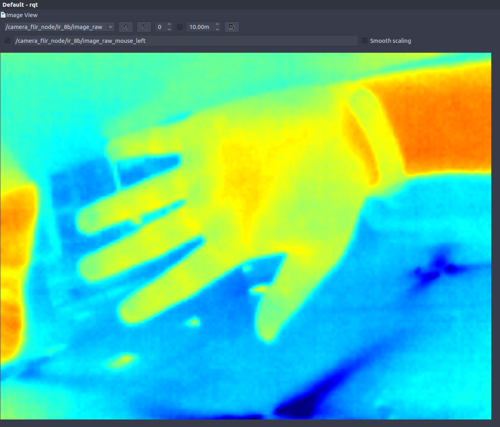

# A simple node for flir one camera on linux

install udev rules and enjoy

the node publish : 
- RGB stream
- 16bit IR stream
- 8bit IR rescaled stream

## How to run the node

At first, you should copy the rules`51-usb-flir-one.rules` to your computer `/etc/udev/rules.d`,and the you can run the node `rosrun flir_one_node flir_one_node`, the run the `rqt`to subscribe the topic.

-  ` cv::applyColorMap(im8bResized, im_color, cv::COLORMAP_JET);`

   I modified the original author's code and used `applyColorMap` to add color to the thermal imaging grayscale.

